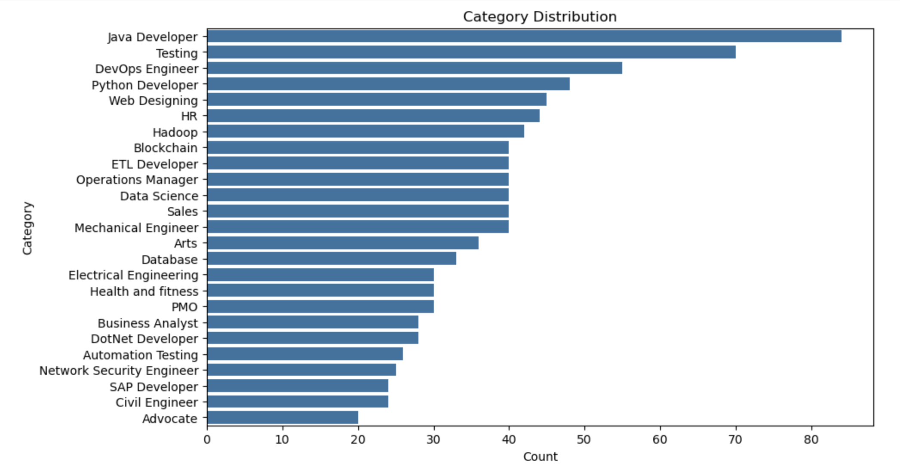

# Resume Screening Application

**Prepared for**: UMBC Data Science Master's Capstone, supervised by Dr. Chaojie (Jay) Wang

**Author**: Supraja Bekkem 

**Semester**: Fall 2024  

**GitHub Repository**: [GitHub Repository](https://github.com/SuprajaBekkem/UMBC-DATA606-Capstone)

**LinkedIn Profile**: [LinkedIn Profile](www.linkedin.com/in/bekkemsupraja)

**Streamlit Web App**: [Streamlit Application](https://app1py-wtczfunvqv55bav8xza3pf.streamlit.app)

**PowerPoint Presentation**: [Presentation Link](https://github.com/SuprajaBekkem/UMBC-DATA606-Capstone/blob/main/docs/capstone.pptx)

**YouTube Video**: [YouTube Presentation Link](https://youtu.be/CvmyIs0VG_o?si=na_U7tQXtxb0h4Kl)

---

## 1. Background

### Project Overview
- The "Resume Screening Application" is designed to streamline the recruitment process by leveraging Natural Language Processing (NLP) techniques to automatically classify and rank resumes based on job requirements. 
- The tool allows recruiters or hiring managers to upload resumes, and the app processes and ranks them based on how well they align with a given job description.
- This solution addresses one of the major challenges in recruitment—manually screening hundreds or thousands of resumes—which is both time-consuming and subject to human bias.

### Significance
- Efficient and unbiased resume screening is critical to improving recruitment processes. By automating this step, recruiters can significantly reduce the time required to identify top candidates, improving the overall hiring experience. Additionally, it helps mitigate bias by focusing on skills, qualifications, and experience rather than irrelevant factors. 
- This application serves to enhance both the accuracy and consistency of resume evaluations, leading to better-informed hiring decisions and a faster time-to-hire.

### Research Questions
- Can NLP models effectively classify and rank resumes based on their relevance to specific job descriptions?
- What combination of NLP techniques, such as word embeddings (TF-IDF, Word2Vec) and classification models (Logistic Regression, Random Forest), yields the best accuracy?
- How can unstructured resume data be preprocessed and structured to optimize model performance in ranking candidates?

---

## 2. Data

### Data Sources
The dataset was collected from Kaggle and is supplemented with additional sample resumes from various industries and job roles. Each resume consists of text data, containing both unstructured and semi-structured information, such as work experience, education, skills, and certifications.

### Data Table

| **Category**     | **Resume**                                                                                   |
|------------------|----------------------------------------------------------------------------------------------|
| Data Science     | Skills * Programming Languages: Python (pandas, numpy, scikit-learn, matplotlib), SQL, etc.   |
| Data Science     | Education Details: May 2013 to May 2017 B.E. in Computer Science from XYZ University.         |
| Data Science     | Areas of Interest: Deep Learning, Control Systems, Data Analytics, etc.                       |
| Data Science     | Skills: R, Python, SAP HANA, Tableau, Data Visualization.                                     |
| Data Science     | Education: MCA from YMCAUST, Faridabad; Project Experience in Data Mining.                    |

### Dataset Size
- Approximately 5 MB of data.
- Around 1,200 resumes.

### Data Structure
- **Number of resumes**: ~1,200.
- **Data Format**: Textual information extracted from resumes and job descriptions.
- **Columns**: Category(Majors), Resume.

### What Each Row Represents
Each row corresponds to an individual resume, and the columns contain various attributes such as skills, work experience, educational background, and additional metadata that are critical for matching against specific job requirements.

---
## 3. Exploratory Data Analysis (EDA)

In this section, we explore the dataset to gain insights into the distribution of resumes, word counts, and frequent terms. These insights help us understand the structure and characteristics of the data before model training.

### 3.1 Text Length Distribution

We analyze the distribution of word counts across resumes to understand the variation in resume lengths. This helps us identify whether resumes are typically short or long, and how this might affect model performance.

- **Observation**: The word count in resumes varies significantly, with some resumes being brief, while others are more detailed and lengthy.

### 3.2 Top Keywords

A word cloud was generated to identify the most frequently used words in the resumes. The common terms provide insight into what skills, qualifications, and experiences are most prevalent across all resumes.

- **Most Common Keywords**: Keywords such as "Python," "Machine Learning," "Data Science," "SQL," and "Java" are prevalent in the resumes, indicating that these are the core skills frequently mentioned in job applications related to the technical and data science fields.

### 3.3 Resume Category Distribution

We examined the distribution of resumes across various job categories. This analysis highlights whether there is any class imbalance that might impact model performance.

- **Observation**: The dataset contains an imbalance in job categories, with some categories such as "Data Science" and "Web Development" having a larger number of resumes compared to others.

### 3.4 Word Count by Job Category

We also calculated the average length of resumes for each job category to see if certain categories tend to have longer or shorter resumes.

- **Observation**: Resumes in categories like "Data Science" and "Software Engineering" tend to be longer, likely due to the technical skills and project descriptions that candidates include. In contrast, resumes in categories such as "HR" and "Testing" tend to be shorter.

### 3.5 Missing Data

We checked for missing data in the dataset to ensure there are no null values that could cause issues during model training.

- **Observation**: There are no missing values in the dataset, ensuring consistency for training machine learning models.

### 3.6 Class Imbalance

A closer look into class imbalance revealed that certain job categories have significantly more resumes compared to others. This imbalance may affect model performance, and we may need to apply techniques like oversampling or undersampling to balance the classes.

- **Observation**: Categories such as "Data Science" and "Web Development" are overrepresented compared to categories like "Mechanical Engineering" and "Civil Engineering."

---

## 4. Model Training

### NLP Techniques Utilized
- **Text Preprocessing**: The raw text is cleaned and preprocessed through tokenization, stopword removal, lemmatization, and normalization. This ensures that only relevant textual information is fed into the model.
- **Vectorization**: Textual data is converted into numerical features using TF-IDF (Term Frequency-Inverse Document Frequency) and Word2Vec embeddings, enabling the model to capture the semantic meaning of the resumes and job descriptions.
- **Classification Models**: Multiple machine learning models were utilized for classifying and ranking resumes to determine their relevance to job requirements:
  - **Multinomial Naive Bayes (MultinomialNB)**: A probabilistic classifier well-suited for text classification tasks. It uses word frequency distributions, making it effective in handling high-dimensional data like resume text.
  - **Support Vector Classifier (SVC)**: A powerful classifier that finds the hyperplane with the maximum margin to separate classes. It performs well on text classification by handling both linear and non-linear relationships.
  - **K-Nearest Neighbors (KNeighborsClassifier)**: A non-parametric classifier that categorizes a resume based on the closest training samples. Its simplicity and effectiveness in handling small datasets make it a valuable benchmark model.
  - **OneVsRest Classifier**: A strategy to tackle multiclass classification problems by fitting a separate classifier for each class. This approach allows for better class separation in complex datasets.
  - **Logistic Regression**: A linear model that serves as a robust baseline classifier. It predicts probabilities for each class, making it a reliable choice for resume classification with interpretability in feature importance.

### Performance Metrics
The models are evaluated based on key performance metrics such as:
- **Accuracy**: Measures the overall correctness of predictions.
- **Precision, Recall, and F1-Score**: Evaluates the model's ability to correctly classify resumes relevant to the job description, while minimizing false positives and false negatives.
- **ROC-AUC**: A metric that provides a balanced view of model performance across different classification thresholds, giving insight into the trade-offs between sensitivity and specificity.

### Observations for Classification Models

- **Multinomial Naive Bayes (MultinomialNB)**:
  - **Accuracy**: 97.41%
  - **Precision & Recall**: Generally high across most categories, though with a slight drop in precision for some minority classes.
  - **F1-Score**: The model maintains a high F1-score, indicating a balance between precision and recall. This model is effective for text data but can struggle slightly with imbalanced classes.

- **K-Nearest Neighbors (KNeighborsClassifier) with OneVsRest**:
  - **Accuracy**: 98.45%
  - **Precision & Recall**: Excellent performance across all classes, though some categories like "HR" show slight drops in recall, suggesting sensitivity to class imbalance.
  - **F1-Score**: Maintains high F1-scores, reflecting its strong ability to classify resumes accurately. Its non-parametric nature makes it robust in capturing varied patterns, though it may be slower on larger datasets.

- **Logistic Regression**:
  - **Accuracy**: 99.48%
  - **Precision & Recall**: High precision and recall scores across categories, with minimal variations. This indicates the model’s effectiveness in accurately distinguishing between classes.
  - **F1-Score**: Very high F1-scores across all classes, showing its reliability for text-based classification tasks. Logistic Regression’s linear nature enhances interpretability, making it a top performer in this dataset.

- **Support Vector Classifier (SVC)**:
  - **Accuracy**: 99.48%
  - **Precision & Recall**: SVC achieves near-perfect scores, with only slight variability in minority classes, indicating strong model generalization.
  - **F1-Score**: Consistently high, showcasing excellent balance between precision and recall. SVC is particularly powerful for text classification due to its ability to handle non-linear relationships.

These observations highlight the effectiveness of each model, with Logistic Regression and SVC providing the highest accuracies and balanced F1-scores, indicating robust performance on text classification tasks with your dataset.

---

## 5. Application of the Trained Models

- The final model is deployed using **Streamlit**, a user-friendly platform for creating web applications. The application interface allows recruiters to upload resumes in bulk and input a job description for the system to analyze. 
- The NLP model then processes the resumes, ranks them, and displays the best matches in descending order of relevance. 
- This intuitive interface enables quick access to the most qualified candidates, significantly enhancing the speed and efficacy of the recruitment process.

---

## 6. Conclusion

This capstone project demonstrates how NLP and machine learning can effectively automate and improve the process of resume screening. By reducing manual effort, minimizing biases, and providing a scalable solution, this application offers substantial value to hiring teams across industries. Future work will focus on:
- Refining the ranking criteria to consider additional factors such as soft skills and cultural fit.
- Expanding the dataset to include a more diverse range of resumes across different job sectors.
- Incorporating additional features such as skill-level matching, real-time collaboration between recruiters, and applicant tracking system (ATS) integration.

---

## 7. References

### Books
Jurafsky, D., & Martin, J. H. (2009). Speech and Language Processing: An Introduction to Natural Language Processing, Computational Linguistics, and Speech Recognition (2nd ed.). Pearson Education.
(A comprehensive book on NLP techniques and applications.)
### Tools 
Python Software Foundation. (2023). Python Programming Language Documentation.
(Official Python documentation.)
https://docs.python.org

Scikit-learn Developers. (2023). Scikit-learn User Guide.
(Detailed documentation for scikit-learn library.)
https://scikit-learn.org

Streamlit. Streamlit for Machine Learning and Data Apps.
(Documentation for creating web apps like your project.)
https://streamlit.io
### Dataset
Kaggle. Resume Dataset.
(Source of resume data for the project.)
https://www.kaggle.com

## Key Features and Future Enhancements

To make the app stand out further, some key features and future enhancements could include:
- **Skill extraction**: Advanced techniques to extract and match specific skills between resumes and job descriptions.
- **Bias mitigation**: Algorithms to anonymize personal data (name, gender, etc.) to reduce unconscious bias.
- **Candidate recommendations**: Suggest alternative job roles for candidates who may be more suitable for different roles within the organization.
- **Real-time feedback and collaboration**: Allow recruiters to interact and collaborate within the app to refine the resume ranking process.

By continuously enhancing the features and scalability of this application, the platform has the potential to become a go-to tool for organizations seeking efficient and unbiased resume screening solutions.

